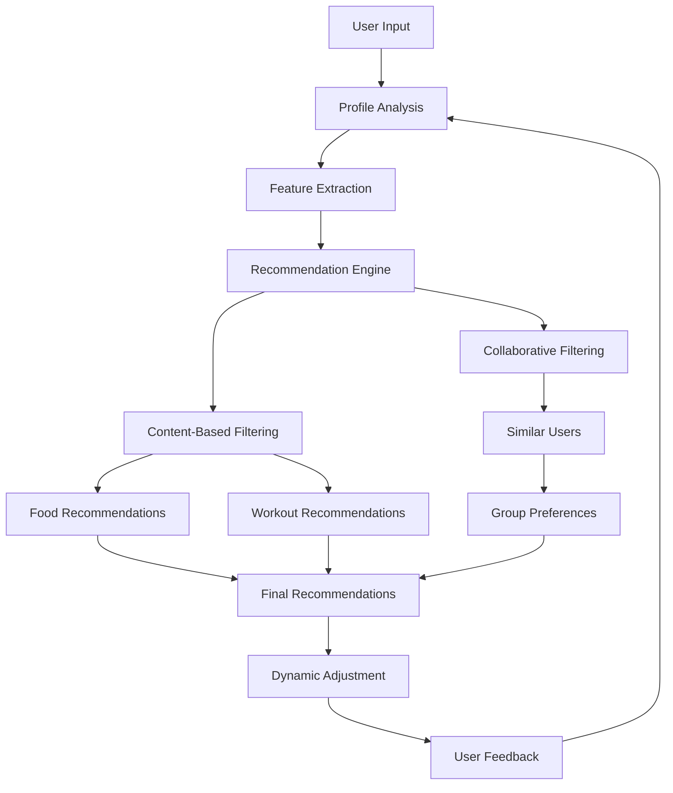

# Tamil Fit Fusion - Personalized Meal & Workout Planner

A React-based web application that generates personalized Tamil cuisine meal plans and workout routines for bulking and cutting goals.

## 🌟 Features

- Personalized meal plans with traditional Tamil cuisine
- Custom workout routines based on fitness goals
- Support for different dietary preferences (Vegetarian/Non-vegetarian/Eggetarian)
- Calorie and macro tracking
- Daily plan view with meals and workouts
- Responsive design for all devices

## 🚀 Quick Start

1. Open [Lovable](https://lovable.dev)
2. Create a new project
3. Use the template command: `/template tamil-fit-fusion`

## 💡 Development Guide

### Using Lovable AI

1. **Create User Profile Features:**
   ```
   Add a profile form with fields for:
   - Fitness goal (bulking/cutting)
   - Food preference
   - Fitness level
   - Schedule duration
   ```

2. **Implement Meal Planning:**
   ```
   Create components for:
   - Daily meal cards
   - Food item display
   - Macro tracking
   ```

3. **Add Workout Integration:**
   ```
   Develop:
   - Workout cards
   - Exercise instructions
   - Progress tracking
   ```

### Project Structure

```
src/
├── components/
│   ├── DailyPlanCard.tsx
│   ├── FoodCard.tsx
│   └── WorkoutCard.tsx
├── data/
│   ├── models.ts
│   └── mockData.ts
├── pages/
│   ├── PlansPage.tsx
│   └── ProfilePage.tsx
└── context/
    └── UserContext.tsx
```

## 📝 Sample Prompts for Development

1. **Setting Up User Profile:**
   ```
   Create a profile form component with fields for fitness goals (bulking/cutting), 
   food preferences (veg/non-veg/egg), fitness level, and schedule duration.
   ```

2. **Creating Meal Plans:**
   ```
   Implement a daily plan card component that displays meals for breakfast, 
   lunch, dinner, and snacks, including calorie and macro information.
   ```

3. **Adding Workout Integration:**
   ```
   Add a workout section to the daily plan card showing exercises, 
   sets, reps, and instructions.
   ```

## 🛠 Technologies Used

- React + TypeScript
- Tailwind CSS
- Shadcn/UI Components
- React Query
- React Router

## 📋 Data Structure

### Food Item
```typescript
interface Food {
  id: number;
  name: string;
  type: 'breakfast' | 'lunch' | 'dinner' | 'snack';
  calories: number;
  protein: number;
  carbs: number;
  fats: number;
  imageUrl: string;
  description: string;
  ingredients: string[];
  suitableFor: FitnessGoal[];
  isVegetarian: boolean;
  isEggitarian: boolean;
}
```

### Workout
```typescript
interface Workout {
  id: number;
  name: string;
  muscleGroup: string;
  level: FitnessLevel[];
  instructions: string[];
  imageUrl: string;
  suitableFor: FitnessGoal[];
  duration: number;
  sets: number;
  reps: number;
}
```

## 🤝 Contributing

Feel free to fork this project and customize it for your needs. If you make improvements, consider sharing them back with the community!

## 📄 License

MIT License - feel free to use this project for personal or commercial purposes.

# Tamil Fit Fusion AI

A personalized Tamil cuisine and workout recommendation system powered by AI.

## 🤖 Machine Learning Implementation

### 1. Recommendation Systems

#### Content-Based Filtering
- **Food Recommendations**
  - Features used:
    - Nutritional content (protein, carbs, fats, calories)
    - Food type (breakfast, lunch, dinner, snack)
    - Dietary preferences (vegetarian, non-vegetarian)
    - Suitability for fitness goals
  - Scoring Algorithm:
    ```typescript
    score = (goalMatch * 0.3) + 
            (dietaryMatch * 0.2) + 
            (favoriteMatch * 0.15) + 
            (nutritionalMatch * 0.2)
    ```
  - Implementation Example:
    ```typescript
    function calculateNutritionalScore(food: Food, userGoal: FitnessGoal): number {
      if (userGoal === 'bulking') {
        return (
          (food.protein > 20 ? 0.4 : 0.2) +
          (food.calories > 400 ? 0.3 : 0.1) +
          (food.carbs > 50 ? 0.3 : 0.1)
        );
      } else {
        return (
          (food.protein > 15 ? 0.4 : 0.2) +
          (food.calories < 300 ? 0.3 : 0.1) +
          (food.fats < 10 ? 0.3 : 0.1)
        );
      }
    }
    ```

- **Workout Recommendations**
  - Features used:
    - Exercise type and muscle groups
    - Difficulty level
    - Duration and intensity
    - User's fitness level
  - Scoring Algorithm:
    ```typescript
    score = (fitnessLevelMatch * 0.3) + 
            (goalMatch * 0.25) + 
            (durationMatch * 0.2) + 
            (varietyBonus * 0.15)
    ```
  - Implementation Example:
    ```typescript
    function calculateWorkoutIntensity(
      workout: Workout,
      userLevel: FitnessLevel,
      completedWorkouts: number[]
    ): number {
      const baseIntensity = {
        beginner: 0.6,
        intermediate: 0.8,
        advanced: 1.0
      }[userLevel];

      const varietyBonus = !completedWorkouts.includes(workout.id) ? 0.2 : 0;
      
      return baseIntensity + varietyBonus;
    }
    ```

#### Collaborative Filtering
- Implementation of user-user similarity using cosine similarity:
  ```typescript
  function calculateCosineSimilarity(user1: UserProfile, user2: UserProfile): number {
    const features1 = extractUserFeatures(user1);
    const features2 = extractUserFeatures(user2);
    
    const dotProduct = features1.reduce((sum, val, i) => sum + val * features2[i], 0);
    const magnitude1 = Math.sqrt(features1.reduce((sum, val) => sum + val * val, 0));
    const magnitude2 = Math.sqrt(features2.reduce((sum, val) => sum + val * val, 0));
    
    return dotProduct / (magnitude1 * magnitude2);
  }

  function extractUserFeatures(user: UserProfile): number[] {
    return [
      user.fitnessLevel === 'beginner' ? 1 : user.fitnessLevel === 'intermediate' ? 2 : 3,
      user.goal === 'bulking' ? 1 : 0,
      user.foodPreference === 'vegetarian' ? 1 : 0,
      // Add more numerical features
    ];
  }
  ```

### 2. Progress Prediction

#### Linear Regression Implementation
```typescript
class ProgressPredictor {
  private weights: number[] = [0, 0, 0]; // [weightTrend, workoutAdherence, dietAdherence]
  private learningRate: number = 0.01;

  trainModel(data: ProgressData[]): void {
    for (let i = 0; i < 1000; i++) { // Training iterations
      for (const sample of data) {
        const prediction = this.predict(sample.features);
        const error = sample.actualProgress - prediction;
        
        // Update weights using gradient descent
        this.weights = this.weights.map((w, j) => 
          w + this.learningRate * error * sample.features[j]
        );
      }
    }
  }

  predict(features: number[]): number {
    return features.reduce((sum, feature, i) => sum + feature * this.weights[i], 0);
  }
}
```

#### Dynamic Difficulty Adjustment
```typescript
class DifficultyAdjuster {
  private readonly PROGRESS_THRESHOLD_HIGH = 0.8;
  private readonly PROGRESS_THRESHOLD_LOW = 0.4;
  private readonly ADJUSTMENT_RATE = 0.1;

  adjustWorkout(workout: Workout, userProgress: number): Workout {
    const intensityMultiplier = this.calculateIntensityMultiplier(userProgress);
    
    return {
      ...workout,
      sets: Math.round(workout.sets * intensityMultiplier),
      reps: Math.round(workout.reps * intensityMultiplier),
      duration: Math.round(workout.duration * intensityMultiplier)
    };
  }

  private calculateIntensityMultiplier(progress: number): number {
    if (progress > this.PROGRESS_THRESHOLD_HIGH) {
      return 1 + this.ADJUSTMENT_RATE;
    } else if (progress < this.PROGRESS_THRESHOLD_LOW) {
      return 1 - this.ADJUSTMENT_RATE;
    }
    return 1;
  }
}
```

### 3. Personalization System Architecture



### 4. Advanced Features Implementation

#### Time Series Analysis for Progress Tracking
```typescript
class ProgressAnalyzer {
  analyzeWeightTrend(weightHistory: number[]): TrendAnalysis {
    const movingAverage = this.calculateMovingAverage(weightHistory, 7);
    const trend = this.calculateTrend(movingAverage);
    const seasonality = this.detectSeasonality(weightHistory);
    
    return {
      trend,
      seasonality,
      prediction: this.forecastNextValue(weightHistory, trend, seasonality)
    };
  }

  private calculateMovingAverage(data: number[], window: number): number[] {
    const result = [];
    for (let i = window - 1; i < data.length; i++) {
      const sum = data.slice(i - window + 1, i + 1).reduce((a, b) => a + b, 0);
      result.push(sum / window);
    }
    return result;
  }

  private calculateTrend(data: number[]): 'increasing' | 'decreasing' | 'stable' {
    const slope = this.calculateLinearRegression(data);
    if (slope > 0.01) return 'increasing';
    if (slope < -0.01) return 'decreasing';
    return 'stable';
  }
}
```

### 5. Performance Metrics

```typescript
interface PerformanceMetrics {
  recommendationAccuracy: number;
  userSatisfaction: number;
  goalAchievementRate: number;
}

class MetricsTracker {
  calculateRecommendationAccuracy(predictions: number[], actuals: number[]): number {
    const mse = predictions.reduce((sum, pred, i) => 
      sum + Math.pow(pred - actuals[i], 2), 0) / predictions.length;
    return 1 / (1 + mse); // Normalize to [0,1]
  }

  calculateUserSatisfaction(ratings: number[]): number {
    return ratings.reduce((sum, rating) => sum + rating, 0) / ratings.length;
  }

  calculateGoalAchievement(
    startMetrics: UserMetrics,
    currentMetrics: UserMetrics,
    goalMetrics: UserMetrics
  ): number {
    const progress = (currentMetrics.weight - startMetrics.weight);
    const goal = (goalMetrics.weight - startMetrics.weight);
    return Math.min(Math.abs(progress / goal), 1);
  }
}
```
